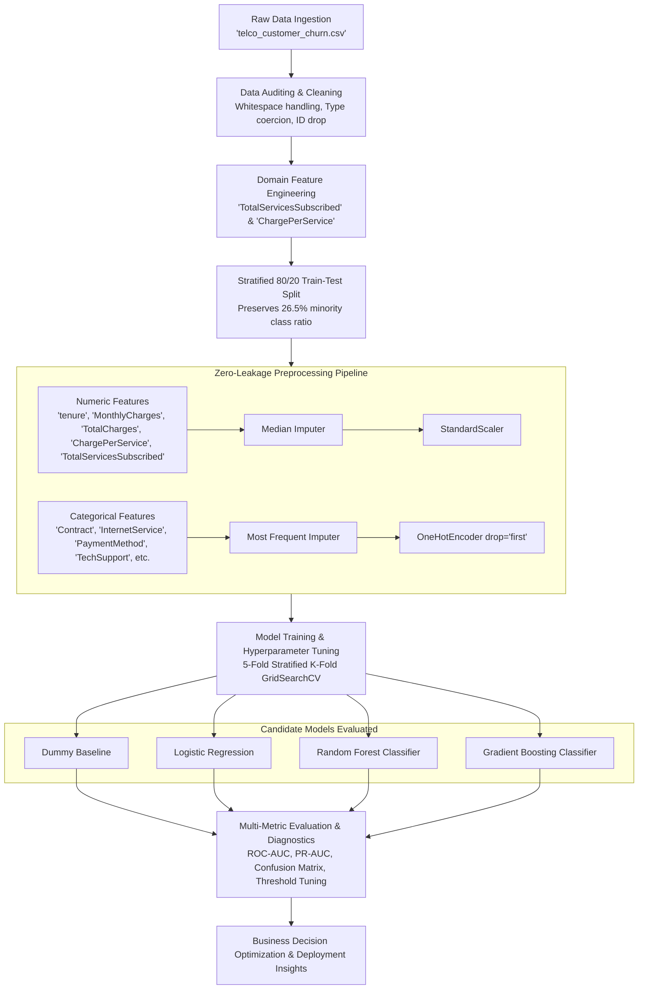

# 📊 Predictive Customer Churn Analytics & ML Model Evaluation

An end-to-end, production-grade supervised machine learning pipeline designed to predict customer churn in the telecommunications industry. This repository implements rigorous data auditing, zero-leakage feature preprocessing, multi-model benchmarking, 5-fold cross-validated hyperparameter tuning, model explainability, and decision threshold calibration.

---

## 📑 Table of Contents

- [Overview & Business Motivation](#-overview--business-motivation)
- [Dataset & Feature Dictionary](#-dataset--feature-dictionary)
- [Pipeline Architecture](#-pipeline-architecture)
- [Key Methodology & Data Quality Standards](#-key-methodology--data-quality-standards)
- [Model Evaluation & Benchmark Results](#-model-evaluation--benchmark-results)
- [Diagnostic Visualizations & Explainability](#-diagnostic-visualizations--explainability)
- [Decision Threshold Calibration & ROI Strategy](#-decision-threshold-calibration--roi-strategy)
- [Actionable Business Recommendations](#-actionable-business-recommendations)
- [Repository Structure](#-repository-structure)
- [Getting Started & Installation](#-getting-started--installation)
- [Tech Stack](#-tech-stack)
- [Limitations & Future Roadmap](#-limitations--future-roadmap)
- [License](#-license)

---

## 🎯 Overview & Business Motivation

Customer acquisition costs (CAC) in the telecommunications sector typically exceed retention costs by **5x to 7x**. Identifying at-risk customers before they cancel enables marketing and customer success teams to execute proactive, high-ROI retention campaigns (such as contract renewal incentives, personalized discounts, or technical support outreach).

### Primary Objectives
1. **Accurate Risk Detection**: Build and tune competitive supervised classification models capable of identifying churn signals in customer behavior and service subscription profiles.
2. **Zero Data Leakage**: Implement encapsulated Scikit-Learn `Pipeline` and `ColumnTransformer` structures to ensure all transformations strictly reflect production inference conditions.
3. **Metric-Driven Decision Calibration**: Optimize business trade-offs between **False Positives** (unnecessary incentive expenses) and **False Negatives** (unmitigated customer loss).
4. **Actionable Insights**: Extract dominant feature importance factors to inform product and pricing strategy.

---

## 📂 Dataset & Feature Dictionary

- **Dataset**: [Telco Customer Churn Dataset (IBM / Kaggle)](https://www.kaggle.com/datasets/blastchar/telco-customer-churn)
- **Observations**: 7,043 customer accounts across 21 raw attributes.
- **Target Variable**: `Churn` (`1` = Customer departed within the last month, `0` = Customer retained).
- **Class Balance**: ~73.5% Retained (`0`), ~26.5% Churned (`1`).

### Feature Taxonomy

| Category | Attributes | Description |
| :--- | :--- | :--- |
| **Demographics** | `gender`, `SeniorCitizen`, `Partner`, `Dependents` | Basic demographic information and household status. |
| **Subscribed Services** | `PhoneService`, `MultipleLines`, `InternetService`, `OnlineSecurity`, `OnlineBackup`, `DeviceProtection`, `TechSupport`, `StreamingTV`, `StreamingMovies` | Active telecommunication, internet, security, and entertainment services. |
| **Account & Billing** | `tenure`, `Contract`, `PaperlessBilling`, `PaymentMethod`, `MonthlyCharges`, `TotalCharges` | Contractual duration, billing mechanisms, and pricing tiers. |
| **Engineered Features** | `TotalServicesSubscribed`, `ChargePerService` | Total active auxiliary service count and average cost burden per service. |

---

## 🏗 Pipeline Architecture



---

## ⚙️ Key Methodology & Data Quality Standards

1. **Type Discrepancy Rectification**:
   - Corrected `TotalCharges` (stored as string/object due to empty whitespace `" "` for new customers with `tenure = 0`). Missing values were imputed to `0.0`.
2. **Identifier Elimination**:
   - Removed `customerID` (100% cardinality) to prevent spurious pattern memorization.
3. **Leakage-Safe Preprocessing**:
   - All scalers (`StandardScaler`) and encoders (`OneHotEncoder`) were instantiated within a Scikit-Learn `ColumnTransformer` inside an overarching `Pipeline`, fitted exclusively on training folds.
4. **Stratified Sampling**:
   - Enforced `StratifiedKFold` (5 folds) and stratified 80/20 train-test splitting to protect against class imbalance distortion.

---

## 📈 Model Evaluation & Benchmark Results

All models were evaluated on the held-out **20% test dataset** ($n = 1,409$).

| Model | Accuracy | Precision | Recall | F1-Score | ROC-AUC | PR-AUC |
| :--- | :---: | :---: | :---: | :---: | :---: | :---: |
| 🏆 **Tuned Gradient Boosting** | **80.48%** | **0.6713** | **0.5187** | **0.5852** | **0.8462** | **0.6651** |
| 🌲 **Tuned Random Forest** | 79.91% | 0.6385 | 0.5561 | 0.5945 | 0.8447 | 0.6628 |
| 📊 **Logistic Regression** | 80.27% | 0.6548 | 0.5401 | 0.5921 | 0.8423 | 0.6580 |
| 🌳 **Random Forest (Default)** | 78.78% | 0.6277 | 0.4947 | 0.5532 | 0.8258 | 0.6262 |
| 🚀 **Gradient Boosting (Default)** | 80.13% | 0.6609 | 0.5107 | 0.5762 | 0.8441 | 0.6596 |
| 📉 **Dummy Baseline (Majority)** | 73.46% | 0.0000 | 0.0000 | 0.0000 | 0.5000 | 0.2654 |

> **Key Takeaway**: The **Tuned Gradient Boosting Classifier** achieved the highest overall discriminative performance with an **ROC-AUC of 0.8462**, demonstrating strong ranking capability across varied decision boundaries.

---

## 🔍 Diagnostic Visualizations & Explainability

The pipeline generates comprehensive visual diagnostics to validate model robustness and uncover business drivers:

1. **Multi-Model ROC & Precision-Recall Curves**:
   - Validates that ensemble boosting and bagging models dominate linear and naive baselines across all operating thresholds.
2. **Confusion Matrix Analysis**:
   - Detailed audits of **Type I Errors (False Positives)** vs **Type II Errors (False Negatives)** to quantify business cost impacts.
3. **Feature Importance Drivers**:
   - **Contract Commitment (`Contract_Two year`, `Contract_One year`)**: The single strongest deterrent to churn.
   - **Customer Tenure (`tenure`)**: Customers in their first 0–12 months exhibit the highest vulnerability to churn.
   - **Internet Service Architecture (`InternetService_Fiber optic`)**: Fiber subscribers show higher churn frequency, indicating potential price sensitivity or setup friction.
   - **Financial Outlays (`TotalCharges`, `MonthlyCharges`, `ChargePerService`)**: High monthly charges without value-added services accelerate departures.

---

## 🎯 Decision Threshold Calibration & ROI Strategy

In customer churn prevention, **False Negatives (losing a customer)** are significantly more costly than **False Positives (sending a discount to an already-loyal customer)**.

```
Cost(False Negative) >> Cost(False Positive)
```

- **Default Threshold (0.50)**: Yields high precision (~67%) but captures only **~52%** of churners (Recall: 0.5187).
- **Calibrated Threshold (~0.35)**:
  - **Recall increases to ~72%** (capturing nearly 3 out of every 4 churners).
  - Maintains acceptable precision (~56%), preventing excessive campaign spend while doubling retention intervention coverage.

---

## 💡 Actionable Business Recommendations

1. **First-Year Onboarding Safeguards**:
   - Implement proactive check-ins, automated setup guides, and concierge tech support during the initial 90 days of customer tenure.
2. **Contract Migration Incentives**:
   - Offer targeted promotional pricing or device upgrades to convert month-to-month subscribers into 1-year or 2-year commitments.
3. **Fiber Optic Service Health Audits**:
   - Investigate service quality and pricing satisfaction among Fiber Optic customers to resolve underlying dissatisfaction.
4. **Bundled Value-Add Add-ons**:
   - Package `OnlineSecurity`, `OnlineBackup`, and `TechSupport` into standard plans; accounts with 3+ active services have drastically lower churn rates.

---

## 📁 Repository Structure

```
├── data/
│   └── telco_customer_churn.csv      
├── Task2_ML_Model_Evaluation.ipynb    
├── requirements.txt                   # Production & experimentation dependencies
└── README.md                         
```

---

## 🚀 Getting Started & Installation

### Prerequisites
- Python 3.9+ installed on your system.

### 1. Clone or Navigate to the Repository
```bash
cd /path/to/AI
```

### 2. Create and Activate a Virtual Environment
```bash
# Windows
python -m venv venv
.\venv\Scripts\activate

# Linux / macOS
python3 -m venv venv
source venv/bin/activate
```

### 3. Install Dependencies
```bash
pip install -r requirements.txt
```

### 4. Launch the Analysis Notebook
```bash
jupyter notebook Task2_ML_Model_Evaluation.ipynb
```

---

## 🛠 Tech Stack

- **Language**: Python 3.9+
- **Machine Learning & Preprocessing**: `scikit-learn`
- **Data Manipulation**: `pandas`, `numpy`
- **Data Visualization**: `matplotlib`, `seaborn`
- **Interactive Environment**: `jupyter`, `ipykernel`

---

## 🔮 Limitations & Future Roadmap

- [ ] **Dynamic Telemetry**: Integrate longitudinal time-series data (e.g., weekly bandwidth usage fluctuations, support ticket velocity).
- [ ] **SHAP & TreeSHAP Explainability**: Provide individualized, customer-level waterfall explanation plots for customer support agents.
- [ ] **Survival Analysis**: Implement Cox Proportional Hazards and Random Survival Forests to predict *time-to-churn* in addition to binary probability.
- [ ] **Cost-Sensitive Learning**: Integrate formal Customer Lifetime Value (CLV) into custom loss functions.

---